# SukaTani 🌾
**Incentivized Farm Financial Engine & AI Audit Platform for Indonesian Smallholder Farmers**

[](https://python.org)
[](https://nextjs.org)
[](https://ai.google.dev)
[](https://elevenlabs.io)
[](https://supabase.com)
[](https://netlify.com)

---

## 📌 Project Overview
Getting smallholder farmers to keep written expense ledgers is one of the hardest challenges in ag-tech. **SukaTani** solves this by offering instant micro-cash rewards when farmers upload photos of agricultural receipts at the farmgate.

In return, Gemini AI automatically audits handwritten receipts, detects duplicates and tampering, categorizes expenses (`COGS`, `OPEX`, `CAPEX`), computes the farmer's true **HPP break-even price**, generates an English spoken audio brief via ElevenLabs, and builds a verified **KUR bank credit report**.

---

## 🏗️ Architecture

```mermaid
flowchart TD
    subgraph Client["📱 Frontend (Next.js 16 / Netlify)"]
        UI["Mobile-First PWA<br/>Dashboard, Camera, Ledger & Reports"]
    end

    subgraph Intelligence["⚡ AI Intelligence API (FastAPI)"]
        OCR["🔍 Gemini 2.5 Vision OCR<br/>Dual-Layer Duplicate & Fraud Audit"]
        MATH["📊 Financial Engine<br/>HPP Calculation & Micro-Incentive"]
        TTS["🎙️ ElevenLabs TTS<br/>Spoken English Audio Brief"]
    end

    subgraph Storage["🗄️ Database & Auth (Supabase)"]
        AUTH["🔐 Supabase Auth<br/>User Profiles & Session Isolation"]
        DB["🗃️ PostgreSQL + RLS<br/>Receipts, Farmer Ledger, Harvest Data"]
    end

    UI -->|1. Upload Receipt Photo| OCR
    OCR -->|2. Line Items & Metadata| MATH
    MATH -->|3. Audio Script| TTS
    MATH -->|4. User-Scoped Insert| DB
    UI -->|5. Sign In / Read Ledger| AUTH
    AUTH -->|6. RLS Filtered Data| UI
```



---

## 🗂️ Clean Repository Structure

```text
.
├── backend/                          # Python Financial Intelligence Backend
│   ├── api.py                        # FastAPI endpoints (/audit, /health, /audio)
│   ├── ocr_pipeline.py               # Gemini Vision receipt analysis & extraction
│   ├── financial_engine.py           # HPP break-even & cash reward math
│   ├── voice.py                      # ElevenLabs natural speech synthesis
│   ├── db.py                         # Supabase database client & helpers
│   └── schemas.py                    # Pydantic data contracts
├── frontend/                         # Next.js 16 Web Application Frontend
│   ├── app/                          # App router (all pages in English)
│   │   ├── page.tsx                  # Splash landing & auth redirect
│   │   ├── login/ & signup/          # User authentication & profiles
│   │   ├── home/                     # Dashboard, wallet & photo audit trigger
│   │   ├── verdict/                  # AI audit result & audio playback
│   │   ├── confirm/                  # Numeric keypad & category classifier
│   │   ├── receipts/                 # Monthly ledger with expandable voice transcripts
│   │   ├── harvest/                  # Seasonal yield & break-even calculation
│   │   └── report/                   # Verified KUR bank credit report
│   ├── lib/                          # Supabase client & protected route hooks
│   ├── public/                       # Static assets & Netlify _redirects
│   ├── Dockerfile                    # Multi-stage standalone frontend Dockerfile
│   └── netlify.toml                  # Netlify build & redirect configuration
├── benchmarks/                       # Hackathon Evaluation Suite & Benchmark Data
│   ├── synthetic_dataset/            # 50-receipt synthetic evaluation dataset
│   ├── scripts/                      # batch_audit_50.py & dataset generators
│   ├── Test_Code.ipynb               # Exploratory prototyping notebook
│   └── README.md                     # Benchmark documentation & test instructions
├── assets/
│   ├── samples/                      # Real-world benchmark farm receipts
│   ├── audio_briefs/                 # Runtime directory for generated MP3 briefs
│   └── uploads/                      # Runtime directory for temporary uploads
├── docs/                             # Architecture & product specifications
├── DEPLOYMENT.md                     # Production deployment guide (Netlify / Docker)
├── Dockerfile                        # Production backend Dockerfile
├── docker-compose.yml                # Full-stack local & VPS orchestration
├── netlify.toml                      # Root Netlify configuration
├── render.yaml                       # One-click Render cloud blueprint
├── requirements.txt                  # Python production dependencies
└── schema.sql                        # Master Supabase database schema with RLS
```

---

## 🚀 Quick Start Guide

### 1. Run the Python Backend API
```bash
# Create virtual environment & install requirements
python3 -m venv .venv
source .venv/bin/activate
pip install -r requirements.txt

# Start backend server
uvicorn backend.api:app --reload --port 8000
```
Backend API will be running at `http://localhost:8000` (Health check at `http://localhost:8000/health`).

### 2. Run the Next.js Frontend
```bash
cd frontend
npm install
npm run dev
```
Frontend web application will be running at `http://localhost:3000`.

### 3. Run with Docker Compose (Full Stack)
```bash
docker compose up --build
```

---

## 🌐 Production Deployment

- **Frontend on Netlify**: Automatically builds from `frontend/out` using [`netlify.toml`](./netlify.toml).
- **Backend on Render / Railway**: Configured via [`render.yaml`](./render.yaml) and root [`Dockerfile`](./Dockerfile).
- See [`DEPLOYMENT.md`](./DEPLOYMENT.md) for full step-by-step instructions.