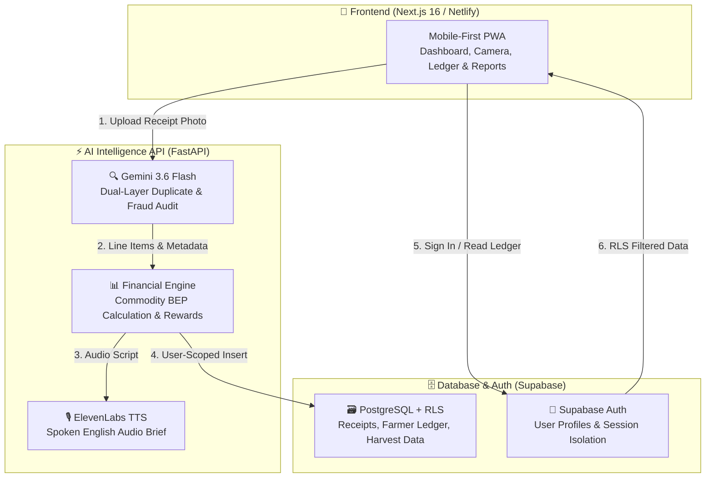

# TaniJaga 🌾
**Farmer's Cost Ledger & AI Financial Underwriting Engine for Indonesian Smallholder Farmers**

[](https://python.org)
[](https://nextjs.org)
[](https://ai.google.dev)
[](https://elevenlabs.io)
[](https://supabase.com)
[](https://netlify.com)

---

## 📌 Project Overview
Getting smallholder farmers to keep consistent expense records is one of ag-tech's biggest hurdles. **TaniJaga (Farmer's Cost Ledger)** solves this by offering instant micro-cash rewards when farmers snap photos of agricultural receipts right at the farmgate.

In return, **Gemini 3.6 Flash** transcribes handwritten Indonesian receipts, detects duplicates and tampering, categorizes expenses (`COGS`, `OPEX`, `CAPEX`), computes the true **Break Even Point (BEP/kg)** across multiple staple crops (**Corn, Chili, Rice**), generates spoken English audio briefings via **ElevenLabs**, and compiles an audit-verified **KUR Bank Credit Report**.

Comprehensive documentation is available in [`docs/comprehensive_guide.md`](file:///Users/rayes/Documents/hackathon/docs/comprehensive_guide.md).

---

## 🌟 Key Features

### 1. Multi-Commodity Cost Engine & Bapenas Price Benchmarks
- **🌽 Corn (Jagung)**: 5,000 kg/ha standard yield | BEP benchmark Rp 3,250/kg | Bapenas market price Rp 5,500/kg
- **🌶️ Chili (Cabai Merah)**: 1,200 kg/ha standard yield | BEP benchmark Rp 23,200/kg | Bapenas market price Rp 32,000/kg
- **🌾 Rice (Padi)**: 5,500 kg/ha standard yield | BEP benchmark Rp 4,500/kg | Bapenas market price Rp 6,800/kg
- User commodity selection is persisted across navigation, ensuring accurate crop-specific yield baselines and calculations.

### 2. Multimodal AI Receipt Audit (Gemini 3.6 Flash)
- Transcribes complex handwritten receipts, store stamps, and wrinkled paper.
- Dual-layer audit checking image quality (1-10), duplicate submissions, and agricultural price anomalies.
- Categorizes line items into accounting categories (Fertilizer, Seeds, Agrochemicals, Labor, Fuel).

### 3. Spoken Audio Briefings (ElevenLabs)
- Converts complex financial metrics into simple spoken English briefings for farmers.
- Advises whether current purchases maintain healthy profit margins relative to live Bapenas market prices.

### 4. Verified KUR Bank Credit Statement & Financial Recap
- Summarizes gross revenue, operating expenses, and net farm income.
- Visual breakdown of inputs by category and top agricultural suppliers.
- One-click exportable credit underwriting report tailored for agricultural bank lenders (e.g., Bank BRI).

### 5. Multi-Tenancy & Offline Persistence
- Row Level Security (RLS) via Supabase isolates farmer data per user account.
- Offline-first browser local storage allows farmers in rural areas with poor connectivity to browse receipts and record harvest data uninterrupted.

---

## 🏗️ Architecture



---

## 🗂️ Repository Structure

```text
.
├── backend/                          # Python Financial Intelligence Backend
│   ├── api.py                        # FastAPI endpoints (/audit, /audit-batch, /health, /audio)
│   ├── ocr_pipeline.py               # Gemini Vision receipt analysis & extraction
│   ├── financial_engine.py           # Multi-commodity BEP math & micro-rewards
│   ├── voice.py                      # ElevenLabs natural speech synthesis
│   ├── db.py                         # Supabase database client & helpers
│   └── schemas.py                    # Pydantic data contracts
├── frontend/                         # Next.js 16 Web Application Frontend
│   ├── app/                          # Next.js App router
│   │   ├── page.tsx                  # Splash landing page & auth redirect
│   │   ├── login/ & signup/          # User authentication & profiles
│   │   ├── home/                     # Dashboard, wallet & photo audit trigger
│   │   ├── verdict/                  # AI audit result & audio playback
│   │   ├── confirm/                  # Manual edit keypad & category classifier
│   │   ├── receipts/                 # Monthly ledger with voice transcripts
│   │   ├── harvest/                  # Seasonal yield & crop-specific BEP calculator
│   │   └── report/                   # Verified KUR bank credit report & recap
│   ├── lib/                          # Supabase client, ledger storage & hooks
│   ├── public/                       # Static assets & Netlify _redirects
│   ├── Dockerfile                    # Multi-stage frontend Dockerfile
│   └── netlify.toml                  # Netlify build & routing configuration
├── benchmarks/                       # Hackathon Evaluation Suite & Benchmark Data
│   ├── synthetic_dataset/            # 50-receipt synthetic evaluation dataset
│   ├── scripts/                      # batch_audit_50.py & dataset generators
│   ├── Test_Code.ipynb               # Prototyping notebook
│   └── README.md                     # Benchmark documentation & test instructions
├── docs/                             # Architecture & detailed guides
│   ├── comprehensive_guide.md        # Complete application handbook
│   ├── architecture.md               # Technical architecture diagram & data flow
│   ├── supabase_migration.sql        # Database schema with RLS policies
│   └── pitch_and_demo_script.md      # Hackathon pitch & demonstration outline
├── DEPLOYMENT.md                     # Production deployment guide (Netlify / Render / Docker)
├── Dockerfile                        # Backend production container Dockerfile
├── docker-compose.yml                # Full-stack local orchestration
├── requirements.txt                  # Python dependencies
└── schema.sql                        # Master Supabase database schema
```

---

## 🚀 Quick Start Guide

### Prerequisites
- Python 3.10+
- Node.js 18+ and npm
- Valid Google Gemini API Key
- (Optional) ElevenLabs API Key and Supabase project credentials

### 1. Start the Python Backend API
```bash
# Create and activate virtual environment
python3 -m venv .venv
source .venv/bin/activate

# Install dependencies
pip install -r requirements.txt

# Run backend
uvicorn backend.api:app --reload --port 8000
```
API runs at `http://localhost:8000` (Health check: `http://localhost:8000/health`).

### 2. Start the Next.js Frontend
```bash
cd frontend
npm install
npm run dev
```
Web app runs at `http://localhost:3000`.

### 3. Full-Stack with Docker Compose
```bash
docker compose up --build
```

---

## 🧪 Evaluation & Benchmarks
We validate OCR accuracy, duplicate rejection, and financial logic using a 50-receipt synthetic dataset:
```bash
python benchmarks/scripts/batch_audit_50.py
```
Refer to [`benchmarks/README.md`](file:///Users/rayes/Documents/hackathon/benchmarks/README.md) for benchmark methodology.

---

## 🌐 Production Deployment
- **Frontend on Netlify**: Configured via [`frontend/netlify.toml`](file:///Users/rayes/Documents/hackathon/frontend/netlify.toml) with edge redirects.
- **Backend on Render / Railway / Docker**: Configured via [`render.yaml`](file:///Users/rayes/Documents/hackathon/render.yaml) and [`Dockerfile`](file:///Users/rayes/Documents/hackathon/Dockerfile).
- For complete setup instructions, see [`DEPLOYMENT.md`](file:///Users/rayes/Documents/hackathon/DEPLOYMENT.md).
