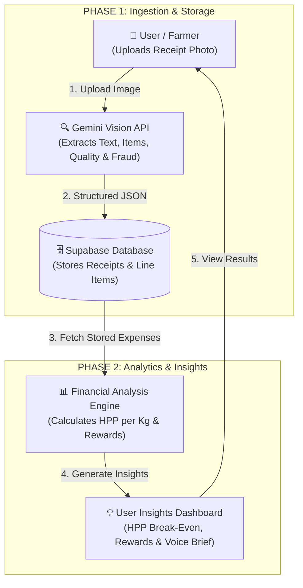

# SukaTani 🌾
**Incentivized Farm Financial Engine & Audit Platform for Indonesian Smallholder Farmers**

[](https://python.org)
[](https://ai.google.dev)
[](https://supabase.com)
[](LICENSE)

---

## 📌 Project Overview
Getting smallholder farmers to keep written expense ledgers is one of the hardest challenges in ag-tech. **SukaTani** solves this by offering instant micro-cash rewards when farmers upload photos of agricultural receipts at the farmgate.

In return, Gemini AI automatically extracts handwritten receipts, audits for potential middleman fraud or image manipulation, classifies expenses into strict financial buckets (`COGS`, `OPEX`, `CAPEX`), and calculates the farmer's true **HPP (Harga Pokok Penjualan / Cost of Goods Sold)** to protect them from selling harvests at a loss.

---

## 🏗️ Architecture & 2-Phase Flow



---

## 🗂️ Repository Structure

```text
.
├── assets/
│   └── samples/              # Test receipt images (e.g. test2.jpeg)
├── docs/                     # Project blueprints & architecture docs
│   ├── architecture.md       # Tech stack & Supabase vs Elasticsearch decision
│   ├── gemini_integration.md # Gemini Vision API integration blueprint
│   ├── ideation.md           # Product design thinking & business impact
│   ├── reward.md             # Reward calculation math specification
│   ├── sukatani.md           # Master blueprint & 4-step pipeline
│   └── testing_strategy.md   # CORD dataset & Pillow synthetic data generator
├── src/                      # Modular Python package
│   ├── __init__.py
│   ├── financial_engine.py   # HPP break-even & cash reward math
│   ├── ocr_pipeline.py       # Gemini Vision API call with Pydantic contract
│   └── schemas.py            # Pydantic data models (ReceiptEvaluation, CostItem)
├── .env.example              # Environment variable template for team
├── .gitignore                # Git ignore rules (.env, .venv, etc.)
├── main.py                   # Main executable entry point script
├── requirements.txt          # Python dependencies
└── schema.sql                # Supabase PostgreSQL database table schemas
```

---

## 🚀 Quick Start Guide

### 1. Prerequisites
- Python 3.10+
- Google Gemini API Key ([Get a free key at Google AI Studio](https://aistudio.google.com/))

### 2. Environment Setup
```bash
# Clone the repository
git clone https://github.com/oejanggg/tanijogo.git
cd tanijogo

# Create and activate virtual environment
python3 -m venv .venv
source .venv/bin/activate

# Install dependencies
pip install -r requirements.txt
```

### 3. Configure API Keys
Copy `.env.example` to `.env` and add your Gemini API Key:
```bash
cp .env.example .env
```
Edit `.env`:
```env
GEMINI_API_KEY=your_gemini_api_key_here
```

### 4. Run Receipt Audit Execution
```bash
python3 main.py assets/samples/test2.jpeg
```

---

## 📊 Core Financial Formulas

### 1. Cash Incentive Reward
$$\text{Payout (IDR)} = \text{Base Reward (Rp 5,000)} \times \left( \frac{\text{Image Quality Score}}{10} \right)$$
*(If fraud is detected or `is_original_receipt` is False, Payout = Rp 0)*

### 2. HPP (Harga Pokok Penjualan) Break-Even Calculation
$$\text{Total Production Cost} = \sum \text{COGS} + \sum \text{OPEX} + \left( \frac{\sum \text{CAPEX}}{24} \right)$$

$$\text{HPP per Kg} = \frac{\text{Total Production Cost}}{\text{Estimated Harvest Yield (Kg)}}$$

---

## 🗄️ Database Setup (Supabase)
Run [**`schema.sql`**](file:///Users/rayes/Documents/hackathon/schema.sql) in your Supabase SQL Editor to create the `receipts` and `line_items` tables automatically.