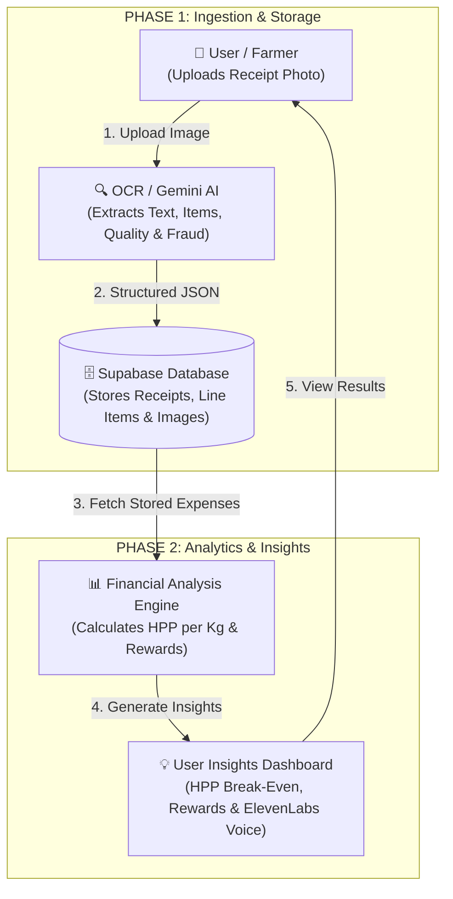

# **SukaTani Technical Architecture & Stack Selection**
**Hackathon Decision Document**

---

## **1. Platform Choice: Mobile-First Web App (Next.js PWA)**

### **Decision: Mobile-Responsive Web Application**
* **Frontend:** Next.js + Tailwind CSS (Deployed on Vercel)
* **Target Audience:** Smallholder farmers (e.g., Pak Joko) operating Android/iOS smartphones at the farmgate.

### **Why Mobile-First Web App Beats a Native App for the Hackathon:**
1. **Zero Install Friction:** Farmers open the application instantly via URL or QR code without needing Google Play Store or Apple App Store installation.
2. **Native Camera Access:** HTML5 file inputs allow direct mobile camera triggering:
   ```html
   <input type="file" accept="image/*" capture="environment" />
   ```
3. **Hackathon Speed & Live Demo:** Single Next.js codebase deploys instantly to Vercel, allowing judges to test the app live on any laptop or phone.

---

## **2. Database Selection: Supabase (Postgres) vs. Elasticsearch**

### **Decision: Supabase (PostgreSQL)**

| Criteria | **Supabase (PostgreSQL)** ✅ | **Elasticsearch** ❌ |
| :--- | :--- | :--- |
| **Primary Use Case** | Relational Financial Ledgers, Transactions, Line Items | Log indexing, full-text search engine |
| **Financial Integrity** | **ACID Compliant** (Exact IDR totals, zero math drift) | Eventual consistency (not designed for accounting) |
| **Data Structure** | Relational (`Farmers` → `Receipts` → `LineItems`) | Flat document search index |
| **Setup Time** | Instant Postgres DB + REST API + Image Bucket in 2 mins | Requires cluster setup, mapping DSLs |
| **Financial Aggregations** | Standard SQL `SUM(amount)` & `GROUP BY` for HPP | Complex aggregation query syntax |

### **Why Supabase Wins for SukaTani:**
* SukaTani is a **financial accounting & fraud audit engine** that requires exact math, relational tables (`receipts`, `line_items`), and image storage (`receipts` bucket). Supabase handles all of this out of the box.

---

## **3. Simplified 2-Phase System Architecture**



---

## **4. Core Database Schema Overview (Supabase / SQL)**

### **`receipts` Table**
- `id` (UUID, Primary Key)
- `created_at` (Timestamp)
- `merchant_name` (Text)
- `image_url` (Text)
- `image_quality_score` (Integer, 1-10)
- `is_original_receipt` (Boolean)
- `primary_category` (Enum: `COGS`, `OPEX`, `CAPEX`, `MIXED`, `INVALID`)
- `total_amount_idr` (BigInt)
- `reward_payout_idr` (Integer)
- `fraud_flags` (JSONB Array)

### **`line_items` Table**
- `id` (UUID, Primary Key)
- `receipt_id` (UUID, Foreign Key → `receipts.id`)
- `item_name` (Text)
- `amount_idr` (BigInt)
- `classification` (Enum: `COGS`, `OPEX`, `CAPEX`, `UNCLASSIFIED`)
- `confidence_reasoning` (Text)
