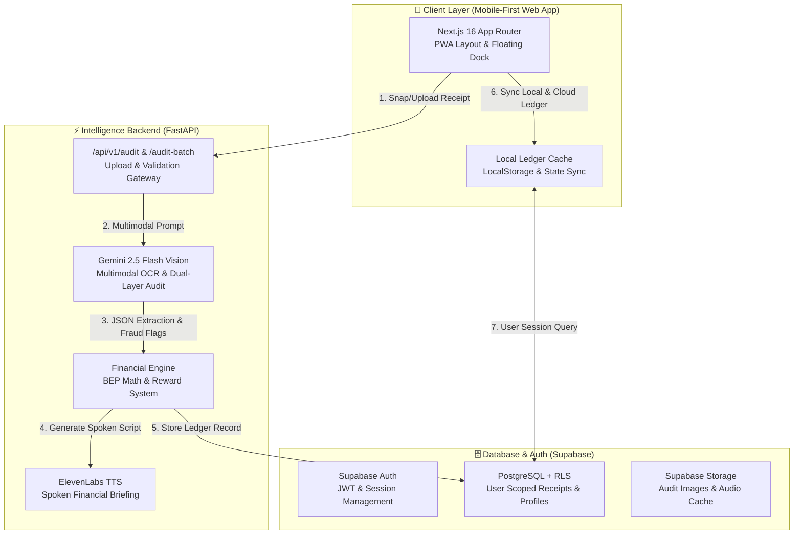
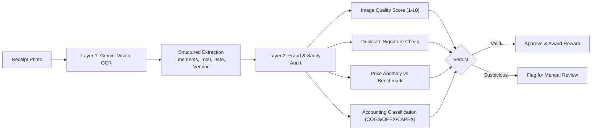

# TaniJaga Comprehensive Application Guide 🌾
**The AI-Powered Farmer's Cost Ledger & Financial Underwriting Engine**

---

## 1. Executive Summary & Problem Space

### The Smallholder Challenge
In Indonesia and across Southeast Asia, over 93% of smallholder farmers operate without formal bookkeeping or expense tracking. Receipts for fertilizers, seeds, diesel, pest control, and labor are scattered, handwritten, faded, or discarded. Consequently:
1. **Zero Cost Visibility**: Farmers cannot calculate their exact **Break Even Point (BEP)** per kilogram, leaving them vulnerable to middleman price exploitation at harvest.
2. **Financial Exclusion**: Banks (e.g., Bank Rakyat Indonesia - BRI) offering subsidized agricultural loans such as **KUR (Kredit Usaha Rakyat)** require historical expense records, cash flow proof, and verifiable supplier relationships—requirements informal farmers cannot fulfill.
3. **Incentive Gap**: Most ag-fintech apps fail because recording daily expenses is tedious, yielding no immediate tangible value to the farmer.

### The TaniJaga Solution
**TaniJaga** solves the adoption problem by transforming farm bookkeeping into an incentivized, zero-friction experience:
- **Instant Micro-Incentives**: Farmers snap receipt photos at the farmgate and receive immediate micro-cash rewards credited to their digital wallet.
- **Multimodal AI Auditing**: Powered by **Google Gemini 2.5 Flash Vision**, receipts are transcribed from crumpled Indonesian paper, checked for tampering, categorized into standard accounting classes (COGS, OPEX, CAPEX), and validated against realistic agricultural price ceilings.
- **Dynamic Break Even Point (BEP)**: The system aggregates verified expenses and projects real-time break-even prices per kilogram across multiple crops (**Corn, Chili, and Rice**), comparing them against live **Bapenas** (Badan Pangan Nasional) market benchmarks.
- **Spoken Audio Briefings**: Farmers receive an instant English voice brief powered by **ElevenLabs**, explaining whether their recent purchases keep them within profitable margins.
- **One-Click Bank Underwriting (KUR Report)**: Historical receipts and harvest metrics automatically synthesize into a verified bank credit statement ready for agricultural loan officers.

---

## 2. System Architecture



### Technology Stack
| Layer | Technology | Primary Role |
|---|---|---|
| **Frontend Framework** | Next.js 16 (App Router, React 19) | Mobile-first responsive UI, PWA layout, offline caching |
| **Styling & Components** | Tailwind CSS & Lucide Icons | High-contrast rural UI, bottom navigation dock |
| **Backend API** | FastAPI (Python 3.10+) | High-performance asynchronous REST endpoints |
| **Vision & Reasoning AI** | Google Gemini 2.5 Flash Vision | Multimodal receipt transcription, fraud auditing, JSON extraction |
| **Voice Synthesis** | ElevenLabs API (`eleven_turbo_v2_5`) | Natural spoken audio briefings for farmers |
| **Database & Auth** | Supabase (PostgreSQL 15 + RLS) | Multi-tenant user isolation, row-level security policies |
| **Deployment Target** | Netlify (Frontend) + Docker/Render (Backend) | Edge delivery, automated container builds |

---

## 3. Supported Commodities & Market Benchmarks

TaniJaga features dedicated parameter modeling for Indonesia's three staple agricultural commodities. Market benchmarks reflect official **Bapenas** standards:

| Commodity | Standard Yield / Hectare | Default BEP Benchmark | Bapenas Market Benchmark | Typical Expense Structure |
|---|---|---|---|---|
| **🌽 Corn (Jagung)** | 5,000 kg | Rp 3,250 / kg | Rp 5,500 / kg | Urea, NPK Phonska, Hybrid Seeds (BISI-18), Tractor Rental |
| **🌶️ Chili (Cabai Merah)** | 1,200 kg | Rp 23,200 / kg | Rp 32,000 / kg | Plastic Mulch, Drip Irrigation, Insecticides, Manual Labor |
| **🌾 Rice (Padi)** | 5,500 kg | Rp 4,500 / kg | Rp 6,800 / kg | Certified Seeds (Ciherang), Subsidized Fertilizers, Thresher |

### Dynamic Commodity Scoping
- The user's active commodity selection is persisted in browser storage (`localStorage["selectedCommodity"]`).
- Navigating between **Home**, **Harvest Calculator**, **Receipts Ledger**, and **Financial Reports** retains the user's active crop without resetting.
- Single and batch receipt audits submit the active `commodity` to the backend, ensuring calculations divide against the proper baseline yield.

---

## 4. Break Even Point (BEP) Mathematical Formulation

### 1. Cost of Goods Sold (COGS / HPP) per Kilogram
The Break Even Point represents the minimum price per kilogram at which the farmer must sell their harvest to recover all operational expenses without making a loss:

$$\text{BEP}_{\text{crop}} (\text{Rp/kg}) = \frac{\sum \text{Total Production Costs (COGS + Direct OPEX)}}{\text{Total Estimated Harvest Yield (kg)}}$$

Where:
- **Total Production Costs** include seeds, fertilizers, pesticides, fuel, irrigation, and field labor.
- **Estimated Harvest Yield** is set by the farmer in the **Harvest Calculator** or defaults to the standard regional yield for the commodity (e.g., 1,200 kg for chili).

### 2. Multi-Receipt Ledger BEP vs. Single-Receipt Auditing
- A single scanned receipt represents an incremental cost contribution, not the entire season's cost.
- TaniJaga scopes incremental receipts to the active commodity. In the **Home View**, the BEP card displays the season's verified BEP from the **Harvest Calculator** (`bep_{crop}`), falling back to the official **Bapenas** regional benchmark if seasonal yield data has not yet been recorded.
- This prevents a single Rp 3.5M receipt from arbitrarily skewing the farmer's displayed BEP across unrelated crops.

### 3. Profit Margin Calculation
Given a selling price $P_{\text{sell}}$ (or the prevailing Bapenas market price $P_{\text{market}}$):

$$\text{Projected Profit Margin (\%)} = \left( \frac{P_{\text{sell}} - \text{BEP}}{P_{\text{sell}}} \right) \times 100$$

When $P_{\text{sell}} > \text{BEP}$, the platform highlights a green safe zone:
> *"Selling above Rp 23,200/kg guarantees a profit. Current market benchmark is Rp 32,000/kg."*

---

## 5. Dual-Layer AI Audit & Fraud Detection

Receipts uploaded in rural conditions face significant visual challenges: shadows, handwritten figures, creased thermal paper, and varying store stamps. TaniJaga implements a robust two-layer pipeline:



### Layer 1: Multimodal OCR Extraction
The backend utilizes Gemini 2.5 Flash with structured JSON output enforcing `ReceiptExtraction`:
- `merchant_name`: Extracted vendor or agricultural kiosk name.
- `transaction_date`: ISO format date.
- `line_items`: Array of items with unit prices, quantities, and line totals.
- `total_amount_idr`: Total verified monetary transaction.
- `primary_receipt_category`: One of `fertilizer`, `seeds`, `pesticides`, `equipment`, `labor`, `fuel`, or `general`.

### Layer 2: Fraud & Sanity Rules
1. **Duplicate Detection**: The engine hashes key transactional attributes (vendor + date + exact amount + item count). Identical submissions are flagged as duplicates.
2. **Quality Scoring (1-10)**: Evaluates focus, lighting, and legibility. Images scoring under 4 prompt the farmer to retake the photo.
3. **Price Outlier Detection**: Compares item unit prices against typical agricultural market bounds (e.g., Urea 50kg bag between Rp 120,000 and Rp 350,000).
4. **Micro-Reward Issuance**: Receipts passing validation earn instant micro-rewards (typically Rp 500 – Rp 2,500) credited directly to the farmer's in-app wallet.

---

## 6. Spoken Audio Briefing (ElevenLabs)

Many smallholder farmers prefer listening over reading dense tabular summaries. After auditing:
1. The backend crafts an informative, concise English summary of the transaction:
   > *"Receipt from Toko Tani Makmur verified for 850,000 Rupiah. This purchase adds 708 Rupiah per kilogram to your chili production cost. Your margin remains healthy against the 32,000 Rupiah market price."*
2. The text is synthesized using ElevenLabs' `eleven_turbo_v2_5` model (voice: George or natural voice).
3. The resulting audio is stored, returned via `/audio/{filename}`, and cached alongside the receipt record for instant playback on the Home and Ledger pages.

---

## 7. Financial Reports & KUR Bank Underwriting

The **Report View** (`/report`) compiles all verified receipts into an exportable, printable credit underwriting document designed for bank loan officers:

### 1. Income & Expense Statement
- **Gross Projected Revenue**: Total harvest yield multiplied by the target selling price.
- **Total Operational Expenses**: Verified sum of all input receipts (Fertilizer, Seeds, Pesticides, Labor).
- **Net Farm Income**: Projected gross profit before taxes.
- **Profit Margin & Operating Ratio**: Financial health indicators required by agricultural lenders.

### 2. Supplier & Input Breakdown
- Visual distribution of farm inputs categorized into Seeds, Fertilizers, Agrochemicals, and Equipment.
- Top vendor breakdown highlighting reliable local agricultural kiosks.

### 3. Monthly Expense Timeline
- Chronological spending trend showing peak cash requirements during planting and mid-season fertilization.

### 4. KUR Readiness Score
- Generates an underwriting grade (A, B, C) based on receipt consistency, record duration, and operational margin.

---

## 8. Data Privacy & Offline Resilience

1. **User Session Isolation (Supabase RLS)**:
   - When a farmer logs in, all database queries are filtered by `auth.uid() = user_id`.
   - Guest sessions are securely segregated using browser local storage, ensuring guest data is never exposed to other registered accounts.
2. **Offline-First Local Storage**:
   - The ledger persists locally in `localStorage["farmer_ledger"]`.
   - If network connectivity drops at the farmgate, receipts remain browsable and actionable.
   - When connection is restored, records synchronize seamlessly with Supabase.

---

## 9. API Reference

### `POST /api/v1/audit`
Audits a single receipt image.

**Request**:
- `multipart/form-data`
  - `file`: Image binary (JPEG, PNG, WebP)
  - `user_id`: *(Optional)* UUID of authenticated farmer
  - `commodity`: `"corn"` | `"chili"` | `"rice"` (defaults to `"corn"`)

**Response**:
```json
{
  "status": "success",
  "data": {
    "extraction": {
      "merchant_name": "Toko Pertanian Berkah",
      "total_amount_idr": 450000,
      "transaction_date": "2026-03-12",
      "primary_receipt_category": "fertilizer",
      "image_quality_score": 9,
      "line_items": [
        { "name": "Pupuk Urea 50kg", "quantity": 1, "total_price": 450000 }
      ]
    },
    "financial_impact": {
      "total_production_cost": 450000,
      "estimated_yield_kg": 1200,
      "hpp_per_kg": 375,
      "commodity_name": "Chili (Cabai Merah)"
    },
    "reward": 1500,
    "voice_brief": {
      "text": "Receipt from Toko Pertanian Berkah verified for 450,000 Rupiah...",
      "audio_url": "/audio/brief_xyz123.mp3"
    }
  }
}
```

### `POST /api/v1/audit-batch`
Audits multiple receipts in parallel for batch onboarding.

**Request**:
- `multipart/form-data`
  - `files`: Array of image binaries
  - `commodity`: `"corn"` | `"chili"` | `"rice"`

---

## 10. Operational & Troubleshooting FAQ

#### Q: Why did the BEP display Rp 701/kg previously?
A: In earlier versions, single-receipt costs were divided by corn's 5,000 kg yield and saved globally. In the current release, BEP is strictly scoped per commodity (`bep_chili`, `bep_corn`, `bep_rice`) and uses commodity-specific yields (1,200 kg for Chili).

#### Q: Can I run TaniJaga without an ElevenLabs API key?
A: Yes! If `ELEVENLABS_API_KEY` is not provided, the backend generates the written English transcript without failing the audit.

#### Q: How do I test with synthetic benchmark data?
A: Navigate to `benchmarks/` and execute:
```bash
python benchmarks/scripts/batch_audit_50.py
```
This runs 50 synthetic farm receipts through the audit engine and reports accuracy and financial metrics.
